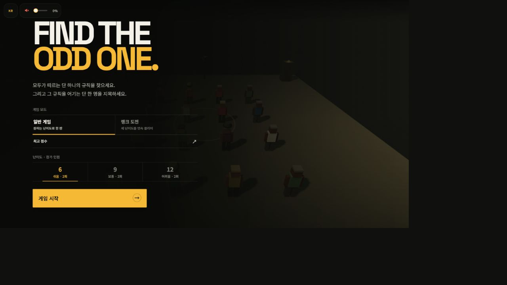

# THE ODD ONE — OpenAI Game Builders Seoul 제출 패키지

> 작성 기준일: 2026-08-23
>
> 대상: OpenAI Game Builders Seoul Track 1 · Online Warm-up Challenge
>
> 게임 사양의 원본은 `theoddone.md`이며, 이 문서는 공식 신청서에 붙여 넣기 위한 제출용 파생 자료다.

## 1. 공식 제출 요건

공식 일정표상 Track 1 예선 접수 기간은 `2026-08-04 ~ 2026-08-26`이다. 마감 시각은 페이지에 명시되어 있지 않으므로 8월 26일보다 앞서 제출하는 편이 안전하다. 예선 심사는 8월 27일, 본선 진출작 발표는 8월 28~30일, 서울 오프라인 본선은 8월 31일이다.

### 필수 입력

- Google 계정 로그인
- 수상 연락 이메일
- 대표자 거주 국가, 생년월일과 필수 약관 동의
- 신청자 성명
- 외부에 공개될 팀명
- 본선 현장 참석 가능 여부
- 긴급 연락처와 행사 운영 안내 수신 여부
- 게임 제목
- 200자 이내 게임 소개
- 별도 승인·복잡한 설치 없이 심사 기간에 실행되는 공개 게임 링크
- 게임 썸네일: 16:9 권장, JPG 또는 PNG 권장, 최대 10MB 권장

### 선택 입력이지만 제출 권장

- 3분 이내 데모 영상 링크: 게임 소개, 실제 플레이와 핵심 기능 포함
- Codex 활용 과정: 사용 위치, 구현 기능, 해결한 문제와 사람이 직접 결정한 부분

### 심사 기준

- Playability: 게임이 실제로 잘 작동하는가
- Originality: 아이디어와 플레이 방식이 독창적인가
- Codex Collaboration: Codex를 효과적으로 활용했는가
- Release Potential: Hive를 통해 서비스를 확장할 수 있는가
- Presentation: 게임과 개발 과정이 명확하게 전달되는가

공식 자료:

- [행사 및 Track 1 안내](https://openaigame2026.com/#details)
- [신청서](https://openaigame2026.com/#apply)
- [참가 약관](https://openaigame2026.com/ko/terms)

## 2. 신청서에 바로 넣을 내용

### 게임 제목

```text
THE ODD ONE
```

### 게임 소개 — 165자

```text
6~12명의 NPC가 보여 주는 행동의 조건과 결과를 관찰하세요. 여러 후보 중 모두가 따르는 단 하나의 숨은 규칙을 찾고, 그 규칙만 어기는 한 명을 두 번의 기회 안에 지목하는 싱글플레이 3D 관찰 추리 게임입니다. 설치·로그인 없이 모바일과 데스크톱 브라우저에서 바로 플레이할 수 있습니다.
```

### 플레이 링크

```text
https://choongchoongee-star.github.io/theoddone/
```

### 공개 저장소 — 신청서 보조 자료

```text
https://github.com/choongchoongee-star/theoddone
```

### 썸네일

- 파일: `submission-assets/the-odd-one-thumbnail-1280x720.png`
- 크기: 1280×720, 16:9 PNG
- 실제 게임 시작 화면을 촬영했으며 현재 로고, 3D NPC와 UI를 그대로 사용했다.



### 심사위원용 빠른 플레이 안내

```text
일반 게임에서 6명 모드를 선택하면 가장 빠르게 핵심 플레이를 확인할 수 있습니다. 화면의 규칙 후보를 읽고 NPC가 조건을 만날 때 어떤 행동을 하는지 관찰하세요. 대부분이 공통으로 지키는 규칙 하나를 찾은 뒤, 그 규칙만 어기는 NPC를 지목하면 됩니다. 기회는 두 번입니다. 첫 플레이에는 현재 기기에 맞는 조작 안내가 표시됩니다.
```

## 3. Codex 활용 과정 — 제출용 본문

```text
THE ODD ONE은 기획부터 구현, 디버깅, 배포와 문서화까지 Codex와 함께 만든 웹게임입니다.

Codex는 TypeScript와 Three.js 기반의 NPC·카메라·행동 규칙 시스템, 데스크톱과 모바일 입력, Web Audio 사운드, 점수·공유·Firebase 리더보드, 반응형 UI와 GitHub Pages 배포를 구현했습니다. 특히 10개 규칙에서 참가 인원에 맞는 후보를 고르고, 정답 규칙만 N-1:1로 배정하면서 가짜 규칙은 반반으로 유지하는 라운드 생성기를 만들었습니다.

반복 QA에서도 Codex를 활용했습니다. 모바일 고발 카메라가 허공이나 잘못된 NPC를 가리키는 문제, 화면 크기 변경이 정답 공개 시점을 덮어쓰는 문제, Chrome Pointer Lock 해제 뒤 커서가 사라지는 문제, 서로 비슷해 보이던 행동 애니메이션과 작은 화면 HUD 가독성을 코드와 실제 화면을 함께 점검하며 개선했습니다. 저장소 이름 변경 뒤 깨진 GitHub Pages 경로와 Firebase 최고 점수 저장 흐름도 수정했습니다.

사람이 직접 결정한 부분은 게임의 핵심 추리 규칙, 종소리를 정답이 아닌 교란으로 쓰는 방식, 6·9·12명 난이도 구성, 두 번의 고발 기회, 행동의 판독성 우선 원칙, 로고와 로우폴리 아트 방향, UI 문구와 최종 플레이 감각입니다. Codex는 이 결정을 구현하고 검증 가능한 코드·문서·커밋으로 유지하는 협업 도구로 사용했습니다.

게임 실행 중에는 생성형 AI나 OpenAI API를 호출하지 않습니다. 모든 NPC 규칙과 행동은 브라우저에서 결정적으로 실행되며, Firebase는 선택형 랭크 최고 점수 저장에만 사용됩니다. 프로젝트는 챌린지 기간인 2026년 8월 16일에 처음 생성되어 전체 개발이 기간 안에 진행되었습니다.
```

### Codex 활용 과정 — 짧은 대체본

입력 칸이 예상보다 짧으면 아래 문장을 사용한다.

```text
Codex와 함께 TypeScript·Three.js 기반 NPC, 10개 행동 규칙 생성기, 데스크톱·모바일 카메라, 반응형 HUD, Web Audio, 점수·공유·리더보드와 GitHub Pages 배포를 구현했습니다. 모바일 고발 카메라, Pointer Lock 커서, 행동 판독성 같은 실제 QA 문제도 반복 수정했습니다. 사람은 핵심 추리 규칙, 난이도, 종 교란, 아트·UI 방향을 결정했고 Codex는 이를 코드·테스트·문서·Git 기록으로 구체화했습니다. 런타임 생성형 AI 호출은 없습니다.
```

## 4. 3분 데모 영상 구성안

권장 길이는 `2분 40초~2분 55초`다. 말로만 설명하지 말고 실제 플레이 화면을 계속 보여 준다.

| 시간 | 화면 | 내레이션 핵심 |
| --- | --- | --- |
| 0:00~0:12 | 로고와 시작 화면 | “모두가 따르는 규칙 하나와, 그것을 어기는 한 명을 찾는 3D 관찰 추리 게임입니다.” |
| 0:12~0:28 | 6/9/12 일반 게임과 랭크 도전 | 설치·로그인 없이 브라우저에서 바로 실행되며 모바일과 데스크톱을 지원한다고 설명한다. |
| 0:28~0:45 | 규칙 안내와 규칙 후보 HUD | 조건이 생기면 행동이 나온다는 구조, 진짜 규칙은 N-1:1이고 나머지는 가짜 단서라고 설명한다. |
| 0:45~1:20 | NPC 이동과 서로 다른 행동 | 빨간 옷 접근, 중앙 진입, 서로 마주보기 등 원인과 Jump·Wave·Spin 같은 결과를 함께 보여 준다. |
| 1:20~1:35 | 종소리 교란 | 일부 NPC에게 행동을 강제하지만 정답 규칙은 아니라는 점을 짧게 보여 준다. |
| 1:35~1:55 | 규칙/NPC 마킹과 FOLLOW | 관찰 중 가설을 기록하고 의심 NPC를 따라갈 수 있음을 보여 준다. |
| 1:55~2:18 | 고발과 정답 공개 | NPC를 지목하고 클로즈업 판정, 성공 또는 마지막 오답 뒤 실제 Odd NPC 공개를 보여 준다. |
| 2:18~2:32 | 점수와 공유 결과 | 일반 점수, 3단계 랭크 도전, 결과 공유 기능을 빠르게 보여 준다. |
| 2:32~2:52 | 코드·Git 기록을 짧게 삽입 | Codex로 규칙 생성, 모바일 카메라, UI, 사운드와 배포 문제를 반복 해결했다고 설명한다. |
| 2:52~2:58 | 로고와 플레이 URL | “관찰하고, 가설을 세우고, 단 한 명을 지목하세요.” |

### 영상 촬영 체크

- 실제 브라우저 플레이를 1080p 이상으로 녹화한다.
- 첫 20초 안에 게임의 목표와 실제 NPC 화면을 모두 보여 준다.
- 마우스 커서나 손가락 위치가 핵심 조건·행동을 가리지 않게 한다.
- 종소리, 오답과 성공 사운드가 들리도록 녹음한다.
- 한 라운드를 전부 실시간으로 보여 주기보다 원인→행동→추리→고발이 선명한 장면을 편집한다.
- 영상은 공개 또는 링크 보유자 열람 상태로 업로드하고 로그아웃 창에서 재생되는지 확인한다.

## 5. 심사 기준별 전달 포인트

| 심사 기준 | 제출에서 강조할 내용 |
| --- | --- |
| Playability | URL 접속 즉시 플레이, 6명 모드로 빠른 진입, 기기별 튜토리얼, 모바일·데스크톱 대응 |
| Originality | 여러 행동 중 “다수가 공유하는 인과 규칙 하나”를 먼저 찾고 그 예외 한 명을 지목하는 2단 추리 구조 |
| Codex Collaboration | 기획→Three.js 구현→실기기 버그 수정→문서 동기화→GitHub Pages 배포까지 이어진 구체적인 협업 기록 |
| Release Potential | 3단계 랭크 코스, 최고 점수 리더보드, 결과 공유 링크, 규칙·NPC·맵을 확장할 수 있는 데이터 중심 구조 |
| Presentation | 3분 안에 원인→행동→가설→고발→정답 공개가 보이는 실제 플레이 영상 |

## 6. 제출 전 권리·운영 확인

- 제출작의 저작권과 지식재산권은 원칙적으로 참가자에게 남는다.
- 주최·주관사는 심사, 행사 운영과 홍보 목적으로 제목, 팀명, 설명, 썸네일, 영상과 플레이 화면을 무상·비독점적으로 사용할 수 있다.
- 제출한 코드, 이미지, 영상, 음원, 폰트, 오픈소스와 외부 서비스의 권리·라이선스를 참가자가 확보해야 한다.
- 본선 진출 시 대표자 1인이 서울 현장에 참석해 발표·시연해야 최종 수상 후보가 될 수 있다.
- 수상자는 공모전 종료일부터 4개월 동안 사업화·투자·퍼블리싱·공동개발 등에 관한 우선협상권을 주최·주관사에 부여한다.
- 팀은 최대 3명이며 팀 참가 시 대표자 1인이 신청과 본선 참석을 맡는다.

## 7. 제출 직전 체크리스트

### 사용자가 직접 입력·결정할 항목

- [ ] 제출에 사용할 Google 계정과 연락 이메일
- [ ] 대표자 성명, 거주 국가와 생년월일
- [ ] 외부 공개 팀명
- [ ] 소속 입력 여부
- [ ] 서울 현장 본선 참석 가능 여부
- [ ] 긴급 연락처와 행사 운영 안내 수신 여부
- [ ] 참가·개인정보·국외 이전 약관 검토 및 동의
- [ ] 데모 영상 촬영, 업로드와 공개 URL 입력

### 게임과 자료 확인

- [ ] 로그아웃 또는 시크릿 창에서 플레이 URL이 승인·로그인 없이 열린다.
- [ ] 데스크톱 Chrome에서 시작→플레이→고발→결과→홈 흐름과 커서 복구를 확인한다.
- [ ] iPhone Safari와 Android Chrome에서 드래그, 핀치, NPC 선택, FOLLOW, 고발과 시스템 공유를 확인한다.
- [ ] 6명 일반 게임으로 핵심 재미를 3분 안에 파악할 수 있는지 처음 보는 사람에게 테스트한다.
- [ ] 종·음량·음소거와 성공·오답 사운드를 확인한다.
- [ ] 6→9→12 랭크 코스 완주, 닉네임 등록과 리더보드 저장을 확인한다.
- [ ] 썸네일 파일이 1280×720 PNG로 정상 열리고 10MB 이하다.
- [ ] 데모 영상이 3분 이내이며 실제 플레이, 핵심 기능과 Codex 활용을 포함한다.
- [ ] 게임 소개가 200자 이내인지 제출 직전에 다시 확인한다.
- [ ] 신청서 제출 후 완료 화면과 확인 메일을 보관한다.

## 8. 현재 준비 상태

| 자료 | 상태 |
| --- | --- |
| 게임 제목 | 준비 완료 |
| 200자 이내 게임 소개 | 준비 완료 · 165자 |
| 공개 플레이 링크 | 준비 완료 |
| 16:9 PNG 썸네일 | 준비 완료 |
| Codex 활용 설명 | 긴 버전과 짧은 버전 준비 완료 |
| 심사위원용 플레이 안내 | 준비 완료 |
| 3분 데모 영상 | 구성안 준비 완료 · 촬영과 업로드 필요 |
| 개인정보·팀명·연락처 | 사용자 입력 필요 |
| 최종 신청서 제출 | 사용자 검토와 약관 동의 후 진행 |
